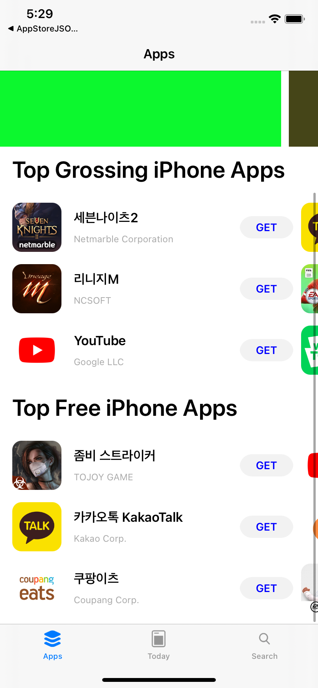
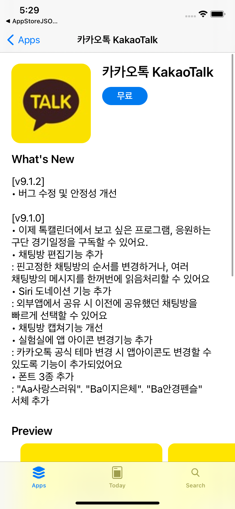
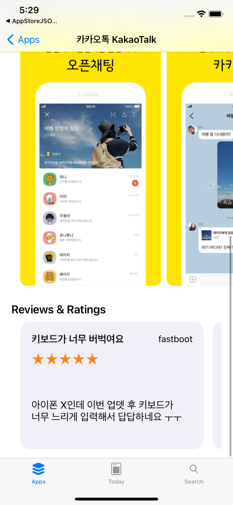
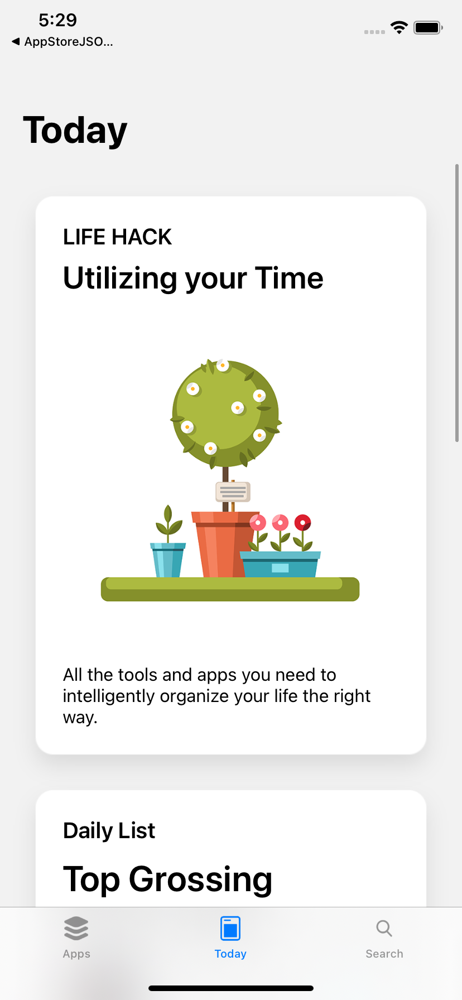
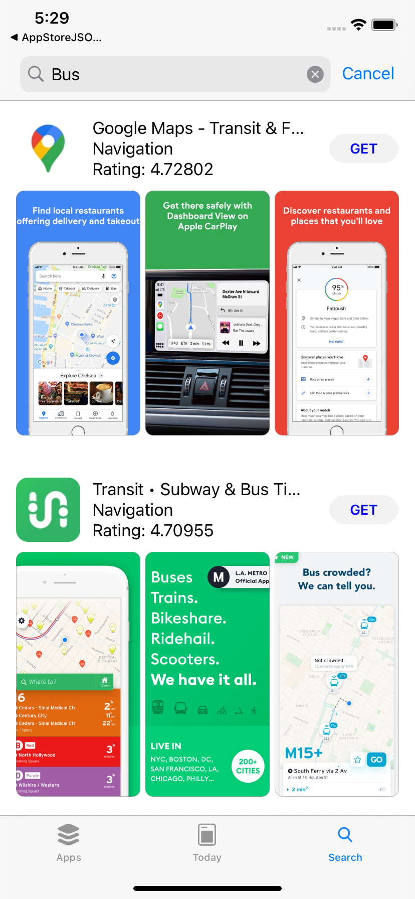

# AppStore Clone App

   AppStore Clone is an example that using uikit, 
    [Combine](https://developer.apple.com/documentation/combine) and [SwiftUI ](https://developer.apple.com/xcode/swiftui/)

   | apps | app detail | app detail2 | today | search | 
   | :-: | :-: | :-: | :-: | :-: | 
   |  |  |  |  | 

   ## TODO
   - [x] Modularization
   - [ ] Networking framwork
   - [ ] support dark Mode
   - [ ] convering SwiftUI
   - [ ] Separate API access from BindableObject
   - [ ] Use Combine with API access
   - [ ] Reflect responses in MainThread via Combine

   ## Requirements

   - Xcode 11 
   - Swift 5.1
   - iOS 12

   ## References

   - https://developer.apple.com/tutorials/swiftui/tutorials
   - https://developer.apple.com/documentation/swiftui
   - https://developer.apple.com/documentation/combine
   - https://developer.apple.com/design/human-interface-guidelines/sf-symbols/overview/
   - [Data Flow Through SwiftUI](https://developer.apple.com/videos/play/wwdc2019/226)
   - [Building Custom Views with SwiftUI](https://developer.apple.com/videos/play/wwdc2019/237)
   - [Combine in Practice](https://developer.apple.com/videos/play/wwdc2019/721)
